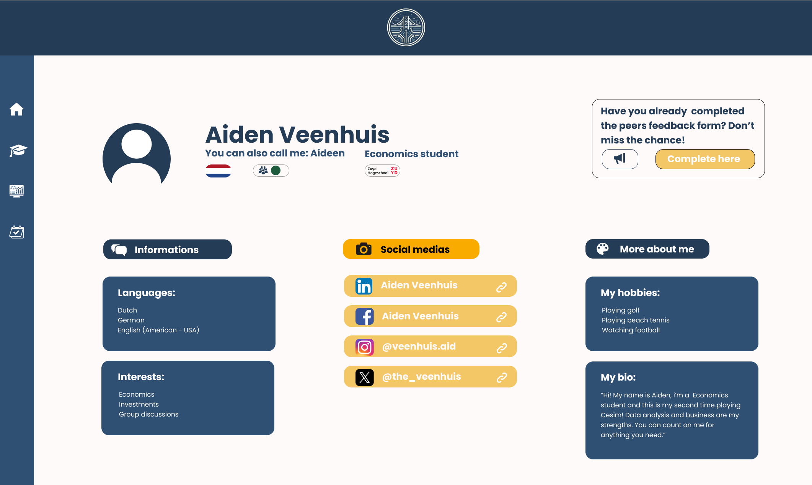

# Ponderada de UX semana 6 - Usabilidade e Acessibilidade 

## 1. Contextualização
&nbsp;&nbsp;&nbsp;&nbsp;A tela abordada nesta análise faz parte do site em desenvolvimento para o parceiro “Zuyd University”. O objetivo do site é auxiliar os estudantes participantes do jogo de negócios “Cesim Global Challenge” realizado pela universidade. Este jogo é feito em equipes com integrantes de diferentes nacionalidades, que frequentemente enfrentam dificuldades de comunicação e compreensão das abordagens de trabalho dos colegas.

&nbsp;&nbsp;&nbsp;&nbsp;Para superar esses desafios, está sendo desenvolvida uma plataforma web que permite aos estudantes descobrir seu perfil de trabalho e os dos seus colegas, além de demonstrar seu nível de satisfação com o grupo e conhecer melhor com quem estão trabalhando. Focando neste último ponto, foi desenvolvida uma tela de perfil para cada integrante do grupo, onde são apresentadas informações relevantes sobre o estudante, como nacionalidade, redes sociais e outras informações que o usuário considere interessante compartilhar. Para possibilitar a navegação para outras seções do site, esta tela inclui uma barra lateral com ícones que representam as principais páginas do site.

<div align="center">

</div>

## 2. Avaliação da acessibilidade e usabilidade da tela 
&nbsp;&nbsp;&nbsp;&nbsp;A tela “Perfil de integrante” antes de apresentar qualquer tipo de alteração apresenta o seguinte html: 
```html
<!DOCTYPE html>
<html lang="en">
<head>
  <meta charset="UTF-8">
  <title>Member profile</title>
  <link rel="stylesheet" type="text/css" href="..\..\assets\styles\style.css">
</head>
<body>
  <nav aria-label="side bar">
    <ul>
      <li>
        <button class="bt">
          
        </button>
      </li>
      <li>
        <button class="bt">
          
        </button>
      </li>
      <li>
        <button class="bt">
          
        </button>
      </li>
      <li>
        <button class="bt">
          
        </button>
      </li>
      <li>
        <button class="bt">
          
        </button>
      </li>
    </ul>
  </nav>
</body>
</html>

```

&nbsp;&nbsp;&nbsp;&nbsp;Sendo assim, para realizar a avaliação da tela, foram utilizados os seguintes critérios:

* Acessibilidade: Verificar se os elementos da interface são acessíveis para usuários com deficiência visual.


* Usabilidade: Avaliar a facilidade de uso da interface para todos os usuários.


&nbsp;&nbsp;&nbsp;&nbsp;Sendo assim, percebeu-se que a tela "perfil de integrante" apresenta falta de acessibilidade e usabilidade na barra de navegação lateral, pois os botões são apenas ícones e não possuem nenhum tipo de texto descritivo. A ausência de descrições textuais nos ícones gera dificuldades de navegação tanto para usuários pouco experientes com a plataforma quanto para deficientes visuais que dependem de leitores de tela para navegar pelo site. Quando esses usuários se deparam com um botão que contém apenas uma imagem sem texto, o leitor de tela não consegue descrever o que está sendo representado, impossibilitando a continuidade da experiência do usuário. Enquanto isso, usuários pouco experientes acabam ficando confusos e não compreendendo o que cada ícone representa.

## 3. Proposta e implementação da mudança 

&nbsp;&nbsp;&nbsp;&nbsp;Diante da falta de acessibilidade e usabilidade exposta na análise realizada da tela escolheu-se realizar a implementação de descrições textuais dos ícones dos botões por meio dos atributo do html `alt` e `title`, sendo que o primeiro fornece uma descrição textual da imagem possibilitando que os leitores de tela descrevam o que o ícone representa, enquanto o segundo fornece uma mensagem quando o usuário passa o mouse sobre a imagem, o que pode ser útil para usuários que necessitam de uma descrição textual do que representa cada botão.

&nbsp;&nbsp;&nbsp;&nbsp;Sendo assim, a implementação dos recursos citados ficaria da seguinte forma:
```html
<!DOCTYPE html>
<html lang="en">
<head>
  <meta charset="UTF-8">
  <title>Member profile</title>
  <link rel="stylesheet" type="text/css" href="..\..\assets\styles\style.css">
</head>
<body>
  <nav aria-label="side bar">
    <ul>
      <li>
        <button class="bt">
          
        </button>
      </li>
      <li>
        <button class="bt">
          
        </button>
      </li>
      <li>
        <button class="bt">
          
        </button>
      </li>
      <li>
        <button class="bt">
          
        </button>
      </li>
      <li>
        <button class="bt">
          
        </button>
      </li>
    </ul>
  </nav>
</body>
</html>

```
## 4 . Melhoria da acessibilidade e da usabilidade 

Com a implementação das descrições textuais dos ícones dos botões por meio dos atributos HTML `alt` e `title`, o projeto se torna significativamente mais acessível para usuários com deficiência visual. Ao fornecer uma descrição textual dos botões, os leitores de tela são capazes de informar corretamente o usuário sobre a função de cada botão, permitindo que os deficientes visuais naveguem pelo site de forma eficiente. Isso promove uma experiência de uso inclusiva e equitativa, onde todos os usuários, independentemente de suas capacidades, têm acesso completo ao conteúdo e funcionalidades do site.

Além disso, as mudanças realizadas também contribuem para a melhoria da usabilidade do projeto. A adição de descrições textuais dos ícones não só beneficia os usuários com deficiência visual, mas também aqueles que não estão familiarizados com os ícones. Ao oferecer uma descrição clara e concisa de cada botão, a interface se torna mais intuitiva e fácil de entender para todos os usuários.
